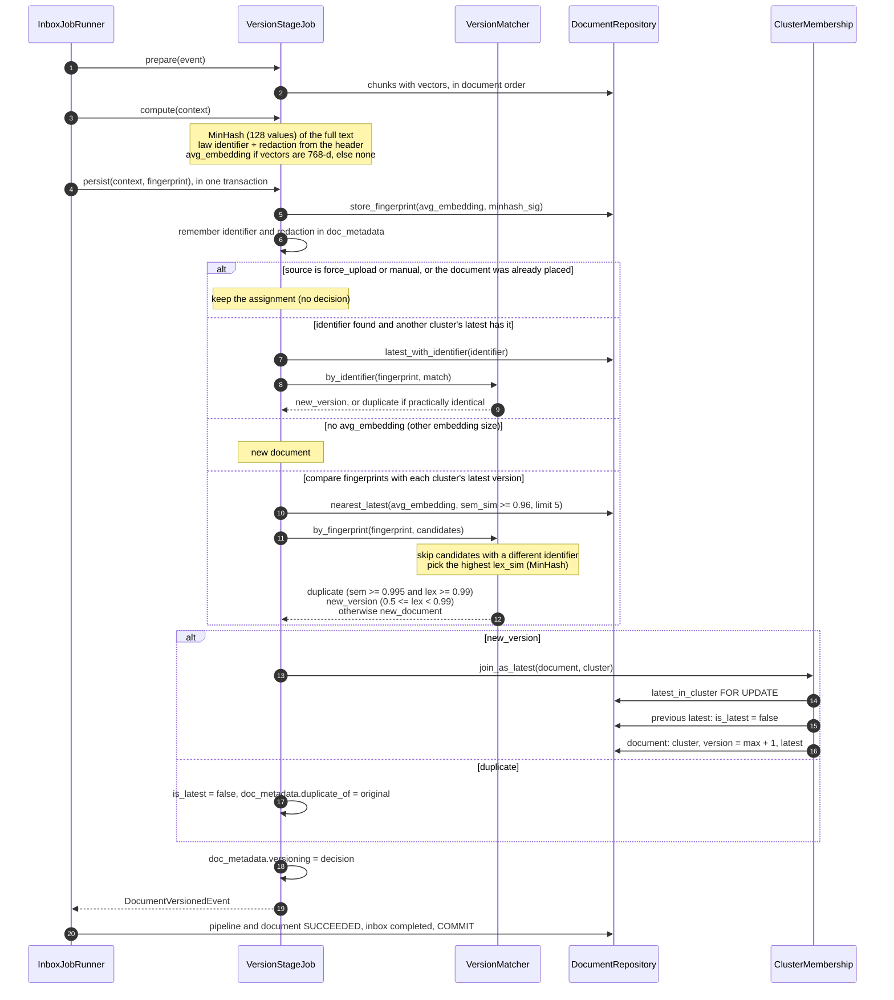

# The versioning stage

Runs after embedding. `compute` builds the fingerprint without the database; `persist` takes
the decision and moves the document in one transaction.

```mermaid
sequenceDiagram
    autonumber
    participant Runner as InboxJobRunner
    participant Job as VersionStageJob
    participant Matcher as VersionMatcher
    participant Docs as DocumentRepository
    participant Members as ClusterMembership

    Runner->>Job: prepare(event)
    Job->>Docs: chunks with vectors, in document order
    Runner->>Job: compute(context)
    Note over Job: MinHash (128 values) of the full text<br/>law identifier + redaction from the header<br/>avg_embedding if vectors are 768-d, else none
    Runner->>Job: persist(context, fingerprint), in one transaction
    Job->>Docs: store_fingerprint(avg_embedding, minhash_sig)
    Job->>Job: remember identifier and redaction in doc_metadata

    alt source is force_upload or manual, or the document was already placed
        Note over Job: keep the assignment (no decision)
    else identifier found and another cluster's latest has it
        Job->>Docs: latest_with_identifier(identifier)
        Job->>Matcher: by_identifier(fingerprint, match)
        Matcher-->>Job: new_version, or duplicate if practically identical
    else no avg_embedding (other embedding size)
        Note over Job: new document
    else compare fingerprints with each cluster's latest version
        Job->>Docs: nearest_latest(avg_embedding, sem_sim >= 0.96, limit 5)
        Job->>Matcher: by_fingerprint(fingerprint, candidates)
        Note over Matcher: skip candidates with a different identifier<br/>pick the highest lex_sim (MinHash)
        Matcher-->>Job: duplicate (sem >= 0.995 and lex >= 0.99)<br/>new_version (0.5 <= lex < 0.99)<br/>otherwise new_document
    end

    alt new_version
        Job->>Members: join_as_latest(document, cluster)
        Members->>Docs: latest_in_cluster FOR UPDATE
        Members->>Docs: previous latest: is_latest = false
        Members->>Docs: document: cluster, version = max + 1, latest
    else duplicate
        Job->>Job: is_latest = false, doc_metadata.duplicate_of = original
    end
    Job->>Job: doc_metadata.versioning = decision
    Job-->>Runner: DocumentVersionedEvent
    Runner->>Docs: pipeline and document SUCCEEDED, inbox completed, COMMIT
```
